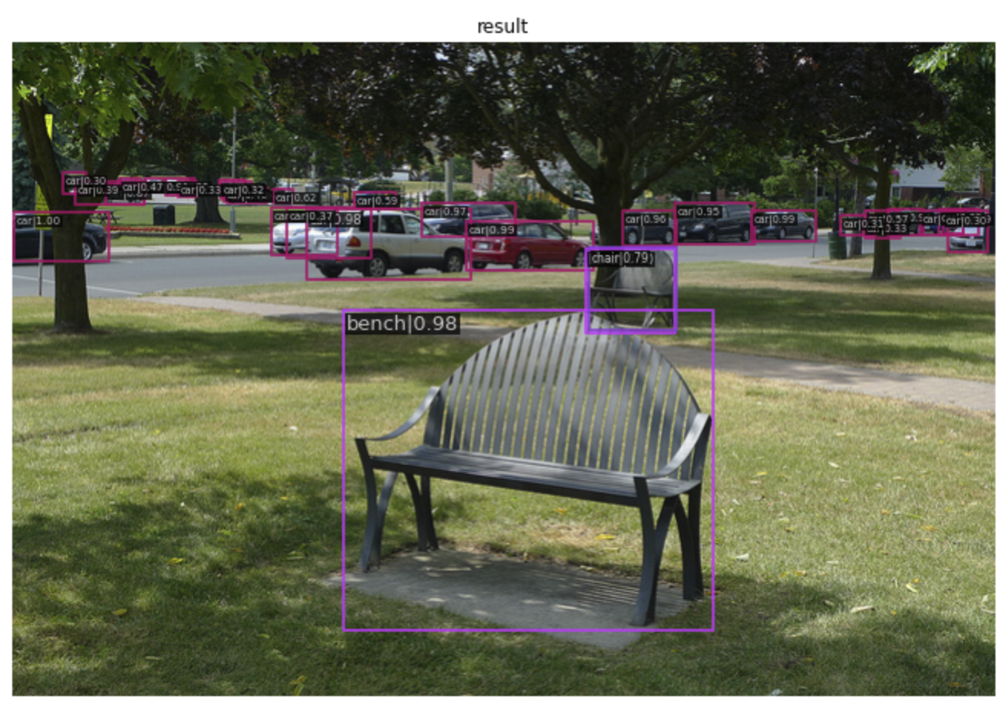

# Small Object Detection Challenge for Spotting Birds @MVA2023

# Contents

Code: This directory contains the project code in both Jupyter Notebook (.ipynb) and Python script (.py) formats. It also includes configuration and base files required for the implementation of bird detection for the competition.

Data: The data used for this project is not included in the repository due to size limitations. However, you can access it from the following Google Drive link: https://drive.google.com/drive/folders/1NWt8lap3spKKK_trOAzkdXAxlEhv2t0m?usp=sharing

## Dataset Directory Structure
**[Download Link](https://drive.google.com/drive/folders/1NWt8lap3spKKK_trOAzkdXAxlEhv2t0m?usp=sharing)**

```
data
 ├ drone2021 (62.4GB)
 │  ├ images
 │  └ annotations
 ├ project_train (9.4GB)
 │  ├ images
 │  └ annotations
 ├ project_test (8.7GB)
    ├ images
    └ annotations(including an empty annotation file)
 ```   

## Repo Structure

```
├── code
│   ├── project_640.ipynb
│   ├── project_640.py
│   ├── config
│       ├── base
│           ├── coco_detection.py
│           ├── faster_rcnn_r50_fpn.py
│           └── faster_rcnn_r50_fpn_1x_coco.py
│       └── faster_rcnn_r50_fpn_1x_bird.py
└── data
```

## Pre-Trained Weights

You can download the pre-trained weights using the following link:
**(https://download.openmmlab.com/mmdetection/v2.0/faster_rcnn/faster_rcnn_r50_caffe_fpn_mstrain_3x_coco/faster_rcnn_r50_caffe_fpn_mstrain_3x_coco_20210526_095054-1f77628b.pth)**

Usage

1. Clone this repository to your local machine.

2. Download the dataset from the provided Google Drive link and place it in the appropriate directory.

3. Install the required dependencies by running pip install -r requirements.txt.

4. Run the Jupyter Notebook or Python script to train and evaluate the bird detection model.

## Snapshots and Demonstrations
Snapshots of the project's result is included for a quick overview of the project's capabilities.


License

This project is licensed under the MIT License. See the LICENSE file for more information.

